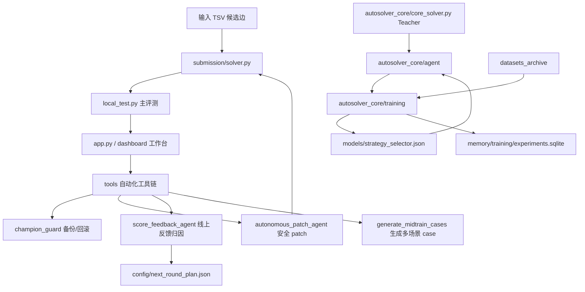
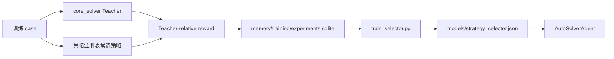

# Meituan_Hackthon 技术说明文档

## 1. 项目定位

`Meituan_Hackthon` 是面向美团配送调度赛题的统一 AutoSolver 工程。它把“最终提交 solver + 本地可视化工作台”和“算法核心 + 离线训练系统”合并到同一个目录中，目标是在有限评测时间内输出合法、高覆盖、低期望成本的骑手-订单分配方案。

当前工程不是单一脚本，而是一个完整的本地求解与训练平台：

- 在线提交侧：`submission/solver.py` 提供评测系统调用的 `solve(input_text)`。
- 本地评测侧：`local_test.py` 统一检查合法性、覆盖率、重复约束和 race expected cost。
- 控制台侧：`app.py` + `dashboard/` 展示 solver 状态、Agent 流程、日志、分数反馈、回滚和审计结果。
- 算法训练侧：`autosolver_core/` 保留 Teacher 求解器、策略注册、Meta Controller、训练脚本和历史实验资产。

工程的核心原则是：**离线复杂，线上极简；训练可沉淀，提交可审计；自动化能改配置，但不能绕过 no-regression gate。**

## 2. 目录与职责边界

```text
Meituan_Hackthon/
├── submission/solver.py           # 唯一提交入口
├── local_test.py                  # 主评测口径
├── app.py                         # 本地工作台 HTTP 服务
├── dashboard/                     # 可视化界面
├── tools/                         # 自动化工具链
├── autosolver_core/               # 算法核心和训练系统
├── cases/                         # 当前主 case
├── generated_cases/               # 当前多场景评测 case
├── datasets_archive/              # 大型训练数据归档
├── memory/studio/                 # 工作台运行状态
├── memory/training/               # 离线训练记忆库
├── logs/studio/                   # 工作台日志
├── logs/training/                 # 核心训练日志
└── backups/legacy/                # 历史和新生成备份
```

边界说明：

| 子系统 | 主目录 | 职责 |
|---|---|---|
| 提交 solver | `submission/` | 只保留最终比赛入口，不依赖 LLM、网络或数据库 |
| 本地评测 | `local_test.py` | 使用和当前 solver 输出一致的 race expected cost 口径 |
| 工作台 | `app.py`, `dashboard/`, `tools/` | 可视化、备份、回滚、分数反馈、安全 patch、本地训练编排 |
| 算法核心 | `autosolver_core/` | Teacher 求解、Agent 策略选择、离线实验、策略蒸馏 |
| 数据资产 | `cases/`, `generated_cases/`, `datasets_archive/` | 区分当前评测数据和大规模训练数据 |
| 运行记忆 | `memory/studio/`, `memory/training/` | 避免工作台状态和训练 SQLite 互相污染 |

## 3. 赛题建模与输入输出

输入是 TSV 文本，每行是一条候选分配边：

```text
task_id_list	courier_id	total_score	willingness
T0037,T0039	C028	52.016	0.582
T0012	C073	49.233	0.1485
```

字段含义：

| 字段 | 含义 |
|---|---|
| `task_id_list` | 一个任务或任务包，多个任务用逗号分隔 |
| `courier_id` | 候选骑手 ID |
| `total_score` | 该候选边的成本分数 |
| `willingness` | 骑手接受概率或意愿度 |

`submission/solver.py` 必须提供：

```python
def solve(input_text: str) -> list:
    ...
```

返回示例：

```python
[
    ("T0005,T0018", ["C045"]),
    ("T0030", ["C031", "C052"]),
]
```

合法性约束：

- 一个任务最多出现在一个返回项中。
- 一个骑手最多出现在一个返回项中。
- 返回的任务包与骑手必须存在于输入候选边。
- 同一任务包可以配置多个备选骑手；本地评测会按 race-style 概率模型计算期望成本。

## 4. 统一评测口径

整合后以 `local_test.py` 为主评测器，而不是 `autosolver_core/evaluate.py`。

原因是当前提交 solver 支持多备选骑手输出，`local_test.py` 会对一个任务包的多个骑手计算 race expected cost：

1. 多个骑手同时尝试接单。
2. 如果至少一个骑手接受，则按接受者数量均分胜出概率并计入分数期望。
3. 如果没有骑手接受，则按未覆盖惩罚计入成本。
4. 所有任务包成本相加，再加未覆盖任务惩罚。

本地评测命令：

```bash
python3 local_test.py submission/solver.py cases/large_seed301.txt --json
python3 local_test.py submission/solver.py generated_cases/tiny_seed42/tiny_seed42.txt --json
```

输出关键字段：

| 字段 | 说明 |
|---|---|
| `valid` | 是否满足重复任务、重复骑手、候选边存在等约束 |
| `covered_tasks` / `total_tasks` | 覆盖任务数 |
| `assignments` | 返回的任务包数量 |
| `couriers_used` | 使用骑手数量 |
| `avg_backups_per_bundle` | 平均每个任务包的备选骑手数 |
| `raw_score_sum` | 所有选中候选边原始分数和 |
| `total_score` | 主评测分数，越低越好 |

当前已验证基线：

| Case | valid | 覆盖 | total_score |
|---|---:|---:|---:|
| `cases/large_seed301.txt` | true | 40/40 | 669.367661 |
| `generated_cases/tiny_seed42/tiny_seed42.txt` | true | 6/6 | 135.668972 |

## 5. 总体架构



系统分为五层：

| 层级 | 作用 |
|---|---|
| 输入解析层 | 解析 TSV 候选边、任务包、骑手、分数和意愿度 |
| 在线求解层 | `submission/solver.py` 在时间预算内输出方案 |
| 本地评测层 | `local_test.py` 统一合法性和期望成本口径 |
| 工作台控制层 | 可视化状态、触发训练、审计、备份、回滚和反馈 |
| 离线训练层 | Teacher 对比、策略实验、参数搜索、策略选择器训练 |

## 6. 在线提交 solver

`submission/solver.py` 是当前唯一线上提交入口。它是一个紧凑的、无网络依赖的静态 solver，内部包含：

- 输入解析和候选建模；
- 场景识别；
- 多组启发式排序策略；
- 局部搜索和替换修复；
- 特殊场景运行时参数覆盖；
- 多备选骑手分配和 race cost 相关逻辑；
- 时间预算控制；
- `format_solution()` 输出标准结构。

工作台的审计逻辑会检查：

- 文件是否存在；
- solver 大小，默认关注 100KB 限制；
- 危险关键词；
- 函数数量和行数；
- SHA-256 哈希。

注意：`autosolver_core/solver.py`、`autosolver_core/solver_best_*.py`、`autosolver_core/solver_archive/*.py` 都不是当前提交入口，不能直接覆盖 `submission/solver.py`。

## 7. 算法核心与 Agent 决策

`autosolver_core/` 来自原算法工程，主要用于离线训练、策略评估和 Teacher 对比。

### 7.1 `core_solver.py`

高性能确定性 Teacher 求解器，负责输入解析、候选建模、启发式搜索、局部修复和输出格式化。训练阶段会把它作为性能下界或教师模型进行对比。

### 7.2 `agent/feature_extractor.py`

从输入中提取实例特征，包括：

- 任务数、骑手数、候选边数；
- 骑手/任务比例；
- 候选密度；
- 意愿度均值、方差、分位数；
- 分数均值、方差、分位数；
- 单任务候选比例、任务包候选比例；
- 场景类型。

典型场景包括：

| 场景 | 判定倾向 |
|---|---|
| `low_willingness` | 平均意愿度低 |
| `scarce_couriers` | 骑手/任务比例低 |
| `sparse_candidates` | 候选密度低 |
| `bundle_heavy` | 任务包候选比例高 |
| `high_score_variance` | 分数波动大 |
| `normal` | 常规场景 |

### 7.3 `agent/strategy_registry.py`

统一注册可选策略和预算变体，包括：

| 策略 | 作用 |
|---|---|
| `core_single_teacher` | 严格单骑手 Teacher |
| `core_default_teacher` | 默认 Teacher |
| `core_parallel_teacher` | 允许多骑手备选的 Teacher |
| `single_fast_greedy` | 快速贪心 |
| `single_balanced_search` | 平衡搜索和轻量修复 |
| `single_scarce_bundle_repair` | 稀缺骑手/组合订单修复 |
| `single_ilp_micro` | 小规模精确优化切片 |
| `parallel_low_willingness` | 低意愿场景多备选策略 |
| `parallel_normal_tail_backup` | 常规尾部备选骑手补强 |

策略还包含显式预算变体，例如：

```text
single_balanced_search@2500ms
single_balanced_search@5000ms
single_scarce_bundle_repair@7000ms
core_single_teacher@9200ms
```

### 7.4 `agent/meta_controller.py`

`AutoSolverAgent` 是核心 Agent 调度器。执行流程：

1. 调用 `feature_extractor` 提取特征。
2. 读取 `models/strategy_selector.json` 和可选 RF selector。
3. 结合内置先验、学习表和可选经验记忆排序策略。
4. 按剩余时间分配预算。
5. 运行若干候选策略。
6. 调用 evaluator 选择当前最优结果。
7. 出错时回退到 `core_solver`。

在线提交 solver 当前不直接依赖这套 Agent；它们作为离线训练和未来蒸馏来源保留。

## 8. 离线训练与策略蒸馏

训练资产分布：

| 路径 | 内容 |
|---|---|
| `datasets_archive/training_cases/` | 原小批量合成训练 case |
| `datasets_archive/training_cases_evolution/` | 自进化训练 case |
| `datasets_archive/meituan_1500_training_samples_by_scene/` | 1500 训练样本数据集 |
| `memory/training/experiments.sqlite` | 训练实验记忆库 |
| `autosolver_core/models/strategy_selector.json` | 策略选择器 |
| `autosolver_core/solver_archive/` | 历史 solver 快照 |

常用训练命令：

```bash
cd /Users/johnny/Desktop/大二/美团Agent大赛/Meituan_Hackthon/autosolver_core

python3 training/collect_experiments.py ../datasets_archive/training_cases
python3 training/train_selector.py
python3 training/validate_against_teacher.py ../datasets_archive/training_cases --teacher single
```

训练闭环：



## 9. 工作台与工具链

### 9.1 `app.py`

`app.py` 是零前端构建依赖的本地 HTTP 工作台，默认端口 `8765`。它负责：

- 初始化 `memory/studio/`、`logs/studio/`、`backups/legacy/`；
- 读取 solver 审计信息；
- 聚合 Notes、Handover、patch、训练和反馈日志；
- 提供 dashboard 静态文件；
- 暴露工作台 API；
- 调用 `tools/` 下的脚本执行本地动作。

主要接口：

| 接口 | 说明 |
|---|---|
| `GET /api/state` | 工作台完整状态 |
| `GET /api/audit` | solver 审计 |
| `GET /api/backups` | 备份列表 |
| `GET /api/logs` | 日志摘要 |
| `GET /api/patches` | patch 报告 |
| `GET /api/qwen/status` | Qwen OCR 配置状态 |
| `GET /api/solver` | 当前提交 solver 源码 |
| `POST /api/action` | 触发训练、审计、备份、回滚、生成 case 等动作 |
| `POST /api/feedback/upload` | 上传线上分数截图 |
| `POST /api/feedback/text` | 粘贴线上分数文本 |
| `POST /api/chat` | DeepSeek Reflector 对话 |

### 9.2 安全备份与回滚

`tools/champion_guard.py` 会把关键文件打包到 `backups/legacy/`，包括：

- `submission/solver.py`
- `memory/studio/current_state.json`
- `memory/studio/trials.jsonl`
- `config/training_config.json`
- `docs/Notes.md`
- `docs/Handover.md`
- `logs/studio/training_rounds.jsonl`

回滚前会自动创建 `pre_restore` 备份，并且只恢复白名单文件。

### 9.3 自动 patch

`tools/autonomous_patch_agent.py` 的流程：

1. 备份当前 solver。
2. 跑本地 benchmark。
3. 如配置 DeepSeek，则请求结构化 patch 计划；否则使用保守本地 fallback。
4. 只允许修改 `submission/solver.py` 中白名单 `CONFIG` 键。
5. 生成 diff。
6. 做静态审计和编译审计。
7. 跑 no-regression gate。
8. 接受或自动回滚。
9. 写入 `memory/studio/patch_reports.jsonl`、`docs/Notes.md`、`docs/Handover.md`。

该工具的设计目标是避免 LLM 任意改代码，保持“可审计、可回滚、可拒绝”。

### 9.4 分数反馈

`tools/score_feedback_agent.py` 支持：

- 上传官方分数截图；
- 使用 Qwen OCR 或本地 OCR 解析；
- 粘贴文本作为无 OCR fallback；
- 识别每个 case 的分数、覆盖和耗时；
- 与上轮反馈或当前 Cockpit 状态做 delta；
- 写入 `config/next_round_plan.json`；
- 更新 `memory/studio/score_feedback_latest.json` 和历史记录。

### 9.5 最终日训练

`tools/final_day_trainer.py` 负责：

- 生成/刷新多场景 case；
- 本地评测当前提交 solver；
- 调用 DeepSeek 或本地 fallback 形成下一轮 patch objective；
- 调用安全 patch agent；
- 记录训练轮次、分数、耗时、备选骑手信息和风险提示。

## 10. 多 Agent 职责

工作台可视化里的 Agent 主要是可解释的职责分工：

| Agent | 职责 |
|---|---|
| Leader Agent | 统筹训练轮次、目标和下一步动作 |
| Data Seed Agent | 生成多场景训练样本 |
| Strategy Agent | 管理策略方向和场景专项改进 |
| Trainer Agent | 执行本地训练、评测和日志记录 |
| HyperParam Agent | 管理 budget、topK、backup 等场景参数 |
| Evaluator Agent | 统计分数、覆盖、耗时、退化风险 |
| LLM Reflector | DeepSeek 归因、patch 计划解释和策略建议 |
| Auditor Agent | 审计 solver 大小、危险依赖、hash、回滚安全 |
| Distiller Agent | 将有效策略压缩为 compact config |
| Submit Agent | 准备提交检查，但不自动提交 |

算法核心里的 Agent 则对应真实代码模块：

| 模块 | 职责 |
|---|---|
| `feature_extractor.py` | 输入特征和场景识别 |
| `strategy_registry.py` | 策略注册和安全参数化执行 |
| `meta_controller.py` | 策略排序、预算分配、候选执行 |
| `evaluator.py` | 结果合法性和质量评估 |
| `reward.py` | 绝对 reward 和 Teacher-relative reward |
| `memory.py` | SQLite 经验记忆 |
| `failure_analyzer.py` | 失败标签和调整建议 |

## 11. 配置与依赖

根 `pyproject.toml` 声明 Python `>=3.12`，主要依赖：

- `dotenv`
- `ipython`
- `langchain`
- `langchain-deepseek`
- `langgraph`
- `openai`

可选依赖：

| 分组 | 用途 |
|---|---|
| `ocr` | Pillow、pytesseract，本地 OCR fallback |
| `ml` | joblib、scikit-learn，训练 RF selector |

环境变量：

| 变量 | 作用 |
|---|---|
| `RSD_STUDIO_PORT` | 工作台端口，默认 `8765` |
| `DEEPSEEK_API_KEY` | DeepSeek 归因和 patch 计划 |
| `DEEPSEEK_BASE_URL` | DeepSeek endpoint |
| `DEEPSEEK_MODEL` | 默认 `DeepSeek-V4-pro` |
| `QWEN_API_KEY` | Qwen OCR |
| `QWEN_BASE_URL` | Qwen endpoint |
| `QWEN_OCR_MODEL` | OCR 模型 |
| `MEITUAN_AGENT_MEMORY` | 离线训练 SQLite 路径 |
| `MEITUAN_AGENT_MODEL` | 策略选择器 JSON 路径 |
| `MEITUAN_ALLOW_PARALLEL` | 是否允许 core agent 多骑手策略 |

## 12. 数据与状态管理

本项目把数据分为三类：

| 类型 | 路径 | 管理原则 |
|---|---|---|
| 当前评测数据 | `cases/`, `generated_cases/` | 保持精简，直接供 `local_test.py` 和工作台使用 |
| 大型训练数据 | `datasets_archive/` | 作为离线训练输入，不放在主源码路径 |
| 运行状态 | `memory/studio/`, `logs/studio/` | 可由工作台更新，支持备份和回滚 |
| 训练记忆 | `memory/training/` | 供 `autosolver_core/training/` 写入和读取 |

当前归档规模：

- 项目总文件数约 1776。
- `datasets_archive/` 中约 1600 个训练数据文件。
- `autosolver_core/solver_archive/` 中保留 14 个历史 solver 快照。

## 13. 典型工作流

### 13.1 本地冒烟验证

```bash
python3 local_test.py submission/solver.py generated_cases/tiny_seed42/tiny_seed42.txt --json
```

### 13.2 主样例验证

```bash
python3 local_test.py submission/solver.py cases/large_seed301.txt --json
```

### 13.3 启动工作台

```bash
python3 app.py
```

### 13.4 备份当前 champion

```bash
python3 tools/champion_guard.py backup --tag manual_snapshot --note "before experiment"
```

### 13.5 生成训练数据

```bash
python3 tools/generate_midtrain_cases.py --base cases/large_seed301.txt --target all --seed 301
```

### 13.6 安全自动 patch

```bash
python3 tools/autonomous_patch_agent.py --objective "保持 champion anchor，优化 high_noise 和 large_seed301"
```

### 13.7 离线训练策略选择器

```bash
cd autosolver_core
python3 training/collect_experiments.py ../datasets_archive/training_cases
python3 training/train_selector.py
python3 training/validate_against_teacher.py ../datasets_archive/training_cases --teacher single
```

## 14. 风险控制

项目内置多层保护：

- `submission/solver.py` 是唯一提交入口，避免 solver 文件混乱。
- 自动 patch 只允许修改白名单配置键。
- no-regression gate 会阻止 protected case 退化。
- 每轮训练或回滚前可生成 zip 备份。
- `app.py` 的 audit 会检查 solver 大小和危险关键词。
- 工作台不会自动提交官方平台。
- 大型训练数据和历史 solver 被归档，不参与日常提交入口。

## 15. 总结

`Meituan_Hackthon` 将原来的算法研究工程和本地可视化工作台整合成一个完整系统。它用 `submission/solver.py` 保持线上提交稳定，用 `local_test.py` 统一本地评测口径，用 `app.py` 和 `tools/` 提供可视化、备份、回滚、反馈和安全 patch 流程，再用 `autosolver_core/` 保留持续训练、策略蒸馏和 Teacher 对比能力。

整体技术路线可以概括为：

```text
稳定提交入口 + 本地严格评测 + 可视化工作台 + 安全自动化 + 离线训练核心
```

这使项目既能在比赛提交时保持轻量可靠，也能在本地持续吸收新 case、线上反馈和训练经验。

